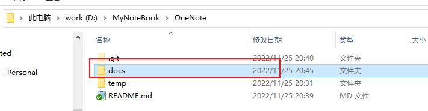
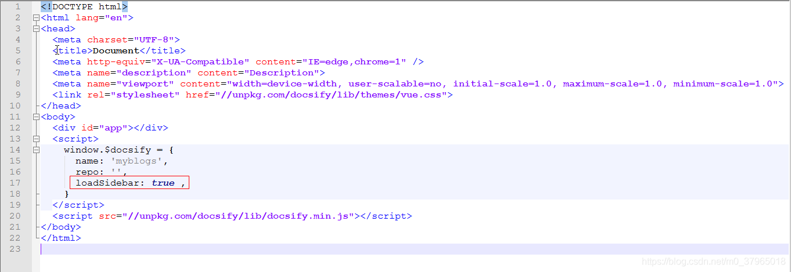
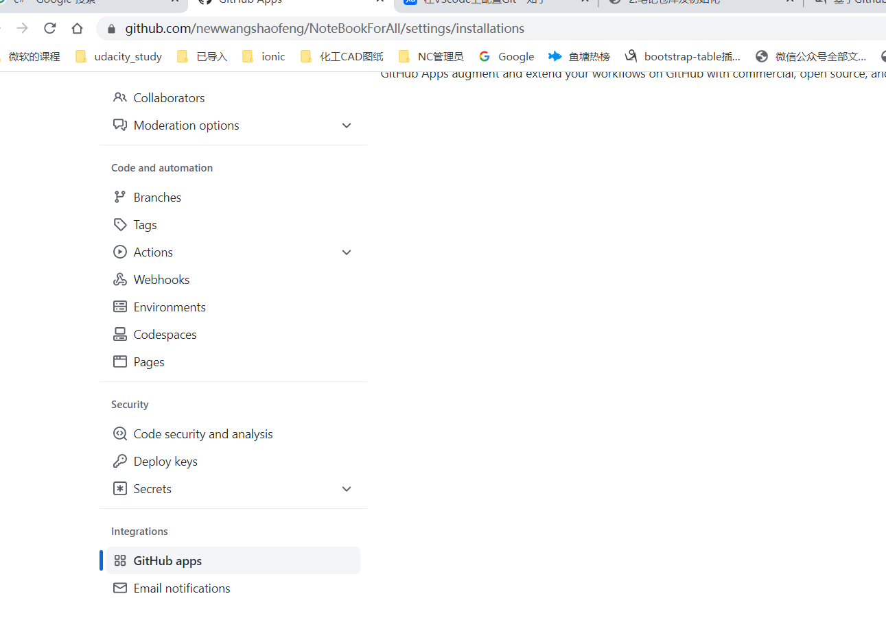

# 笔记仓库及初始化

## 参考博客

1.[基于Github Pages + docsify，我花了半天就搭建好了个人博客 ](https://www.cnblogs.com/happyone/p/12152566.html)

2.[docsify官网](https://docsify.js.org/#/)

## [github](https://github.com/)


## 使用docsify命令生成文档站点

### 1.安装docsify-cli 工具
```
npm i docsify-cli -g
```

### 2.初始化一个项目
```
docsify init ./docs

```



### 3.启动项目，预览效果
```
docsify serve docs
```

### 4. 增加一些配置，变身成真正的blogsite

#### 1、配置左侧导航栏

在 E:\myblogs\docs目录下新建一个_sidebar.md 的md文件，内容如下：
```
- 环境搭建

  - [笔记仓库及初始化](工具使用/笔记仓库及初始化.md)
  - [环境搭建](工具使用/环境搭建.md)


- anki


- 其它
```

开启侧边栏,还需要在index.html文件中配置一下。在内嵌的js脚本中加上下面这句：
```
loadSidebar: true
```



#### 2.配个封面

首先新建一个 _coverpage.md 的md文件，这里面的内容就是你封面的内容。

```
# Myblogs


> 我要开始装逼了


[CSDN](https://blog.csdn.net/m0_37965018)
[滚动鼠标](#introduction)

```
开启封面配置

```
#### 3.配个首页

最后我们来配置下首页，也就是封面完了之后，第一个看到的界面。

其实就是 E:\myblogs\docs 目录下README.md 文件的内容。


# 最迷人的二营长

> [个人博客](https://blog.csdn.net/m0_37965018)


> [GitHub](https://github.com/Corefo/ "github")

使用Github Pages功能建立站点
```



